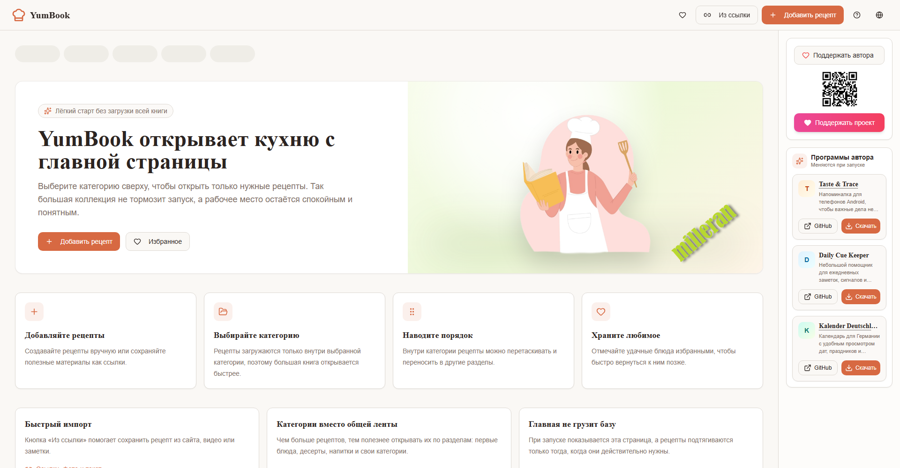

# 🍽️ Taste & Trace — AI Cookbook

AI-powered multilingual recipe management app.

## 📸 Screenshot



## ✨ Features

- **AI Recipe Recognition** — Extract recipes from photos, screenshots, or pasted text
- **URL Import** — Import recipes from YouTube, TikTok, Instagram, and cooking blogs
- **AI Cooking Assistant** — Ask questions about recipes: substitutions, calories, healthier alternatives
- **Interactive Guide** — Built-in AI guide that answers questions about the app
- **Ingredient Substitution** — Find replacements for any ingredient
- **Drag & Drop** — Reorder recipes within categories
- **Kitchen Measures** — Reference table for common measurements and conversions
- **Print** — Print-friendly recipe view
- **15 Languages** — EN, DE, RU, ES, FR, IT, PT, PL, TR, UK, ZH, JA, KO, AR, HI

## 🚀 Installation

```bash
npm install
npm run dev
```

The app runs at `http://localhost:5173`.

## 🔑 Environment Variables

Copy `.env.example` to `.env` and fill in values:

```
VITE_SUPABASE_URL=
VITE_SUPABASE_PUBLISHABLE_KEY=
VITE_SUPABASE_PROJECT_ID=
```

AI keys are managed as backend secrets through Lovable Cloud.

## 🛠️ Technologies

| Layer | Technology |
|-------|-----------|
| Frontend | React 19, TypeScript, Vite |
| Styling | Tailwind CSS, shadcn/ui |
| State | TanStack React Query |
| Backend | Lovable Cloud (Supabase) |
| AI | Lovable AI Gateway (Gemini) |
| i18n | i18next (15 languages) |
| DnD | @dnd-kit |

## 📁 Project Structure

```
src/
├── assets/           # Static files (icons, images, flags)
├── components/       # UI components
│   ├── ui/           # shadcn/ui primitives
│   ├── Header.tsx
│   ├── RecipeCard.tsx
│   ├── RecipeGrid.tsx
│   ├── AssistantModal.tsx    # AI cooking assistant
│   ├── GuideModal.tsx        # Interactive app guide
│   ├── RecipeParserDialog.tsx # AI recipe recognition
│   ├── URLImportModal.tsx    # Import from URL
│   ├── RightSidebar.tsx      # Right panel
│   └── SupportModal.tsx
├── config/           # App, AI, language configuration
├── hooks/            # Custom React hooks
├── lib/              # Library utilities
├── locales/          # Translation files (15 languages)
├── pages/            # Route pages
├── services/         # API & business-logic layer
│   ├── aiService.ts
│   ├── recipeService.ts
│   ├── storageService.ts
│   └── translationService.ts
├── types/            # TypeScript types
├── utils/            # Pure helper functions
└── data/             # Static data (measures)

supabase/
├── functions/        # Edge functions (AI endpoints)
├── migrations/       # Database migrations
└── seed/             # Seed data
```

## 📄 License

[MIT](LICENSE)
